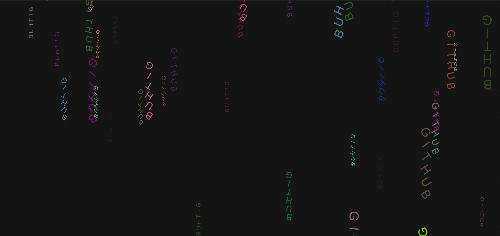

# Text Rain

Make your text raining and rotating.

Example gif⤵

### HOW TO?

Go to this url: http://berkkaraal.com/textRain/?txt=YOUR+TEXT

Change _YOUR+TEXT_ with anything you want and go to that url.

Example url:

http://berkkaraal.com/textRain/?txt=GITHUB

http://berkkaraal.com/textRain/?txt=I+LOVE+YOU

http://berkkaraal.com/textRain/?txt=CODE

_Note:_ You can use '+' for spaces.

----

I used [p5.js](https://p5js.org/) for this project
